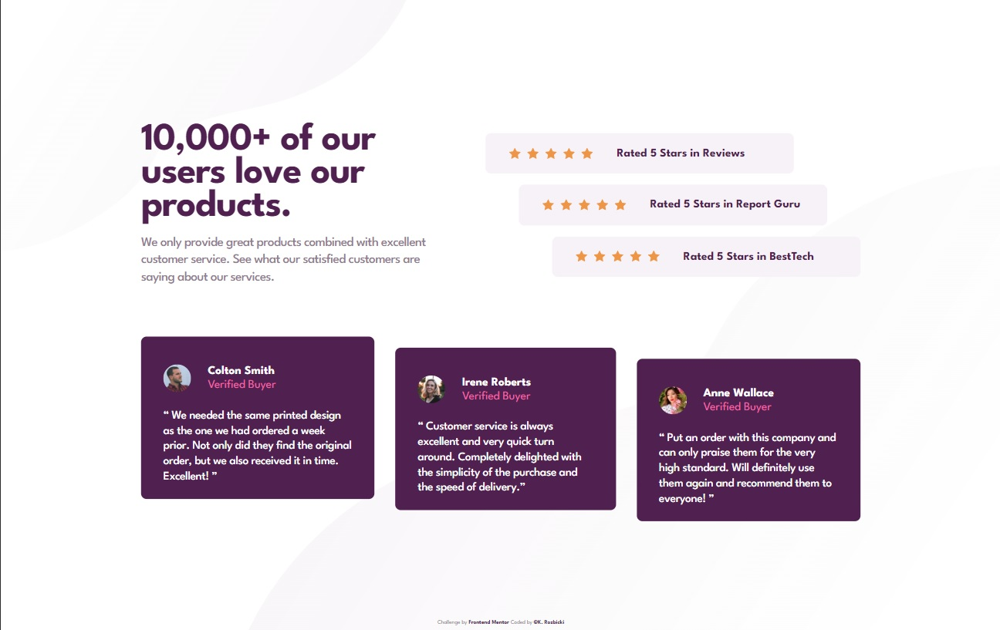

# Frontend Mentor - Social proof section solution

https://krzysztofrozbicki.github.io/fem-challenge-11/

This is a solution to the
[Social proof section challenge on Frontend Mentor](https://www.frontendmentor.io/challenges/social-proof-section-6e0qTv_bA).
Frontend Mentor challenges help you improve your coding skills by building realistic projects.

## Table of contents

- [Overview](#overview)
  - [The challenge](#the-challenge)
  - [Screenshot](#screenshot)
  - [Links](#links)
- [My process](#my-process)
  - [Built with](#built-with)
  - [What I learned](#what-i-learned)
- [Author](#author)
- [Acknowledgments](#acknowledgments)

## Overview

### The challenge

Users should be able to:

- View the optimal layout for the section depending on their device's screen size

### Screenshot

### Links

- [Solution url](https://github.com/KrzysztofRozbicki/fem-challenge-11/)
- [Live site url](https://krzysztofrozbicki.github.io/fem-challenge-11/)

## My process

### Built with

- Semantic HTML5 markup
- CSS custom properties
- Flexbox
- CSS Grid
- Mobile-first workflow

### What I learned

This design looks difficult at first glance but once you dig into dip it is really quite simple - I
did it with using flex and align-self properties. It was good excercise.

## Author

- GitHub - [GitHub](https://github.com/KrzysztofRozbicki)
- Website - [Pogbit](https://www.pogbit.com/)
- Frontend Mentor - [@KrzysztofRozbicki](https://www.frontendmentor.io/profile/KrzysztofRozbicki)

## Acknowledgments

Thanks goes to [GoIt](https://goit.global/pl/) for the great course where in just 12 weeks I have
learned almost full HTML/CSS so i can make these challenges without much struggle!
